# ***PileAnalysis***

## Latest Release

[Click here to download ***PileAnalysis*** V3.0](https://github.com/CanWang-BJTU/PileAnalysis/releases/tag/V3.0)

---

***PileAnalysis*** is an open-source Python-based graphical user interface (GUI) program for pile foundation analysis and pile-soil interaction simulation.

***PileAnalysis*** integrates two computational frameworks:

1. **Linear elastic m-method framework**
   - Powered by a high-performance ***Fortran*** solver.
   - Supports pile group stiffness calculation, single pile stiffness calculation, and back-analysis of pile foundation response.

2. **Nonlinear pile-soil interaction framework**
   - Built on ***OpenSeesPy***.
   - Supports nonlinear *p-y*, *t-z*, and *q-z* soil spring models.
   - Supports axial, lateral, combined loading, and pile group analyses.
   - Supports interaction with ***SectionMCPy***, allowing users to import nonlinear fiber-section data and account for pile material nonlinearity in pile foundation analysis.

***PileAnalysis*** aims to provide engineers, researchers, and students with a convenient, visual, and extensible tool for pile foundation analysis without requiring complex manual scripting.

---

## Reference

<!-- Please add the citation information of the PileAnalysis paper here. -->

---

# Tutorial

***PileAnalysis*** provides nine tutorials covering the main functions of the m-method framework, the nonlinear framework, fiber-section import, and result export. All examples mentioned in this section are built into the **Example** menu of the software. Users can load the corresponding parameters into the GUI with a single click, modify them as needed, and then run the analysis based on the predefined example cases.

Users can click the following links to jump directly to each tutorial:

1. [Tutorial 1: M-method Pile Group Stiffness Analysis](#tutorial-1-m-method-pile-group-stiffness-analysis)
2. [Tutorial 2: M-method Single Pile Stiffness Analysis](#tutorial-2-m-method-single-pile-stiffness-analysis)
3. [Tutorial 3: M-method Back-Analysis](#tutorial-3-m-method-back-analysis)
4. [Tutorial 4: Nonlinear Axially Loaded Pile Analysis](#tutorial-4-nonlinear-axially-loaded-pile-analysis)
5. [Tutorial 5: Nonlinear Laterally Loaded Pile Analysis](#tutorial-5-nonlinear-laterally-loaded-pile-analysis)
6. [Tutorial 6: Nonlinear Combined Loading Analysis](#tutorial-6-nonlinear-combined-loading-analysis)
7. [Tutorial 7: Nonlinear Pile Group Analysis](#tutorial-7-nonlinear-pile-group-analysis)
8. [Tutorial 8: Nonlinear Fiber Section Import](#tutorial-8-nonlinear-fiber-section-import)

---

## Tutorial 1: M-method Pile Group Stiffness Analysis

### 1.1 Interface Overview

This tutorial introduces the group pile stiffness calculation mode in the m-method framework of ***PileAnalysis***.

Before presenting the detailed operation procedure, the main interface of the m-method framework is briefly introduced. As shown in Fig. 1, the main interface consists of five main areas: the **menu bar**, **status bar**, **parameter input area**, **visualization area**, and **result output area**.

- **Menu Bar**  
  The menu bar provides access to the main functions of the program, including example loading, help documentation, result export, navigation, and language switching.

- **Status Bar**  
  The status bar displays the current program status, version information, author information, and operation prompts.

- **Parameter Input Area**  
  The parameter input area is used to select the analysis mode, define pile and soil parameters, configure pile arrangement, and control the analysis process.

- **Visualization Area**  
  The visualization area is used to display the analysis schematic, 3D pile layout, plan layout, and other graphical results after calculation.

- **Result Output Area**  
  The result output area displays the analysis results, including the result summary and the original solver output.

  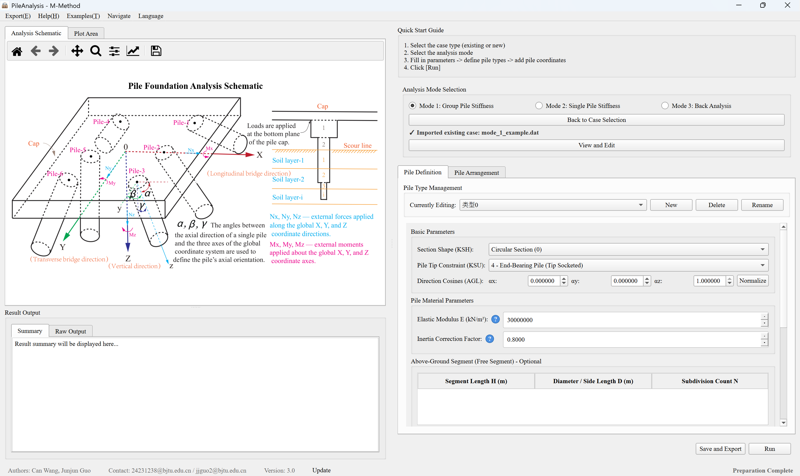

  <b>Fig. 1. Main interface of the m-method framework.</b>

### 1.2 Example Description

This tutorial demonstrates **Mode 1: Group Pile Stiffness** in the m-method framework of ***PileAnalysis***.

In practical foundation design, a pile group is often simplified as an equivalent elastic support when it is connected to the upper structure through a pile cap. In this situation, the key output required by structural engineers is not the response under one specific load case, but the **overall stiffness relationship** between the generalized force vector and the generalized displacement vector at the pile cap reference point.

Mode 1 is designed for this purpose. It calculates the **global 6 × 6 stiffness matrix of the pile group foundation**, including translational and rotational stiffness components. The exported stiffness matrix can be used in subsequent structural analysis or finite element modeling.

The example used in this tutorial is a simple two-pile foundation. The two piles are vertical circular piles arranged symmetrically along the Y direction. Both piles use the same pile type, and no simulated pile is included. This example is intentionally simple, so users can focus on understanding the basic input logic and output interpretation of Mode 1.

In ***PileAnalysis***, a **simulated pile** is an equivalent stiffness element used to represent additional restraint effects in the pile group system. It does not behave as a real physical pile for internal-force output, but contributes stiffness to the global foundation system. This function can be used when users need to consider the influence of existing piles, auxiliary supports, cap-soil resistance, or other simplified boundary restraints.

**P.S.** A simulated-pile example is also provided in the built-in PILE manual examples. Users can load it from the menu bar by selecting **Examples → PILE Manual Examples → Example 2**.

---

### 1.3 Pile Definition

The first step is to define the pile type and the corresponding pile-soil interaction parameters.

In this example, only one pile type is used. The pile is defined as a circular vertical pile. The pile tip is treated as an end-bearing pile with a socketed tip condition. The pile direction cosines are set to indicate a vertical pile axis.

The pile material parameters include the elastic modulus and the inertia correction factor. The embedded pile segment is divided into several soil layers. For each layer, users need to define the layer thickness, pile diameter, soil m value, internal friction angle, and subdivision count. The pile-tip foundation coefficient is also defined at the bottom of the input area.

  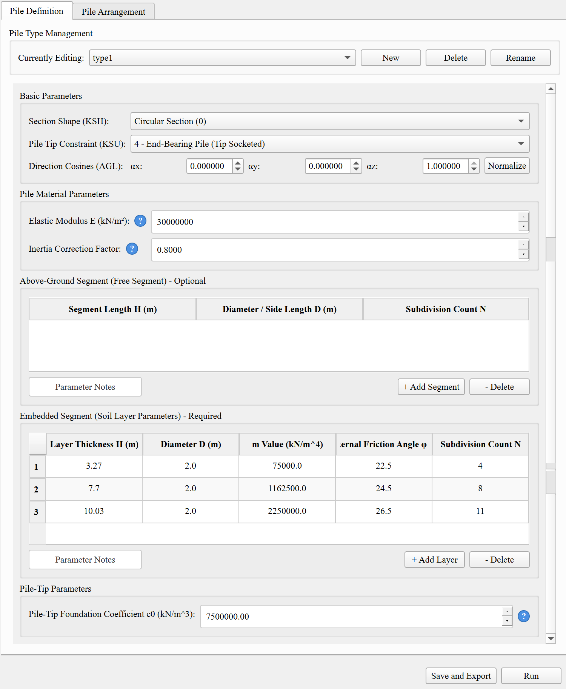

  <b>Fig. 2. Pile definition and soil layer parameters for Mode 1.</b>

During parameter input, ***PileAnalysis*** provides help buttons at the corresponding positions. These help buttons allow users to quickly check the meaning, variable name, unit, and typical range of the current parameter without leaving the input interface.

  

  <b>Fig. 3. Parameter help window for pile segment definition.</b>

In addition to the local help buttons, the program also provides a summarized parameter reference window. This window collects commonly used reference information, such as recommended soil m values, rock c0 values, internal friction angle references, concrete parameters, and pile-tip constraint notes.

  

  <b>Fig. 4. Summary reference table for m-method parameters.</b>

---

### 1.4 Pile Arrangement

After defining the pile type, the next step is to assign pile positions and pile types.

In this example, the foundation contains two piles. Both piles are assigned to the same pile type. Their coordinates are arranged symmetrically along the Y direction:

| Pile No. | X Coordinate (m) | Y Coordinate (m) | Pile Type |
|---|---:|---:|---|
| 1 | 0.000 | 2.250 | type1 |
| 2 | 0.000 | -2.250 | type1 |

The simulated pile option is not enabled in this example. Therefore, the calculated stiffness matrix is contributed only by the two physical piles.

  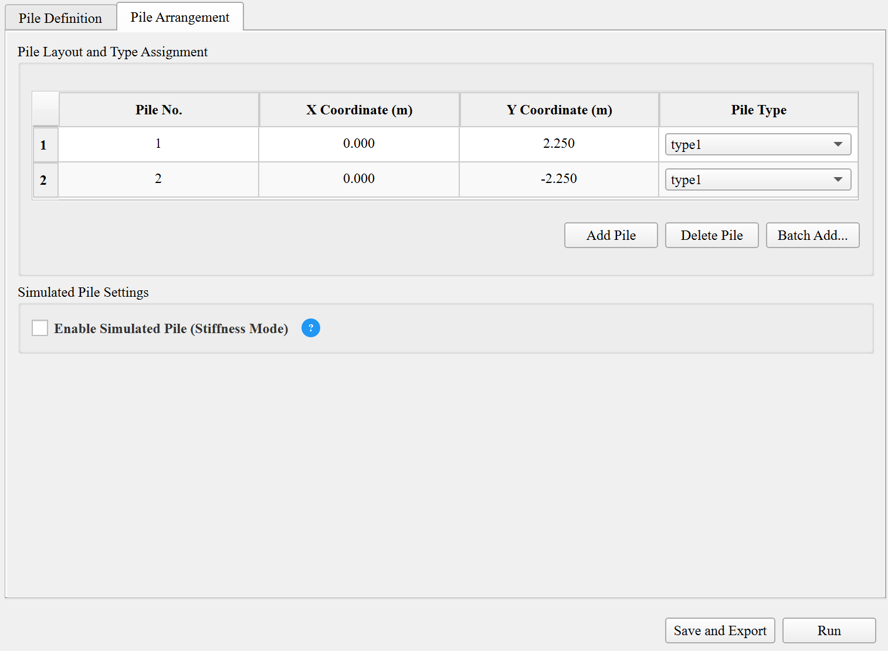

  <b>Fig. 5. Pile layout and pile type assignment.</b>

---

### 1.5 Analysis and Layout Visualization

After the pile definition and pile arrangement are completed, the analysis can be performed. For Mode 1, no external load input is required, because the objective is to calculate the equivalent stiffness of the pile group rather than the response under a specific load case.

After the calculation is completed, the visualization area displays the pile group layout. The 3D view shows the spatial relationship between the pile cap, the piles, and the global coordinate system. This view helps users confirm whether the pile orientation and overall arrangement are consistent with the intended model.

  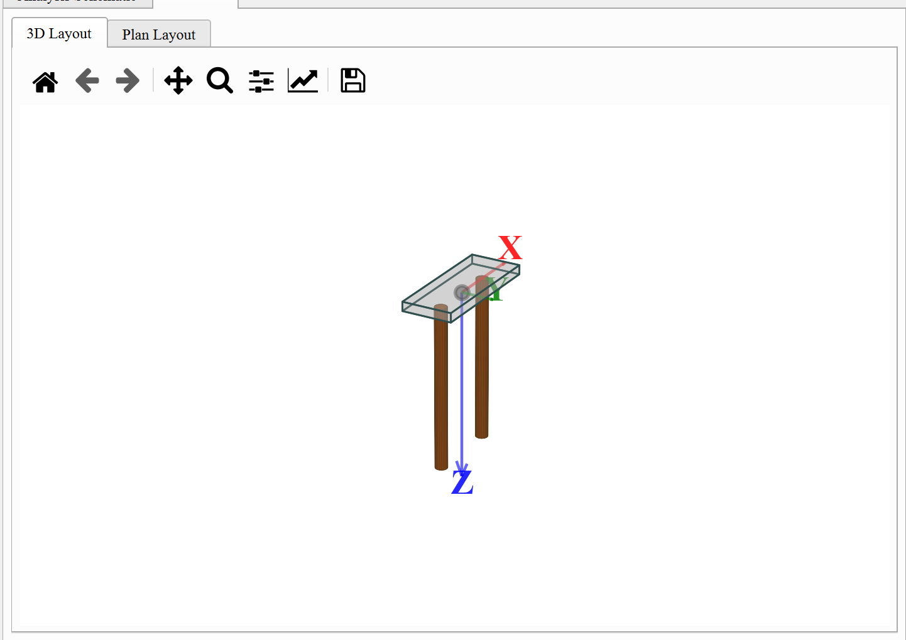

  <b>Fig. 6. 3D layout of the two-pile foundation.</b>

The plan layout shows the pile locations in the X-Y plane. This view is useful for checking pile spacing, pile numbering, and whether the coordinates have been entered correctly.

  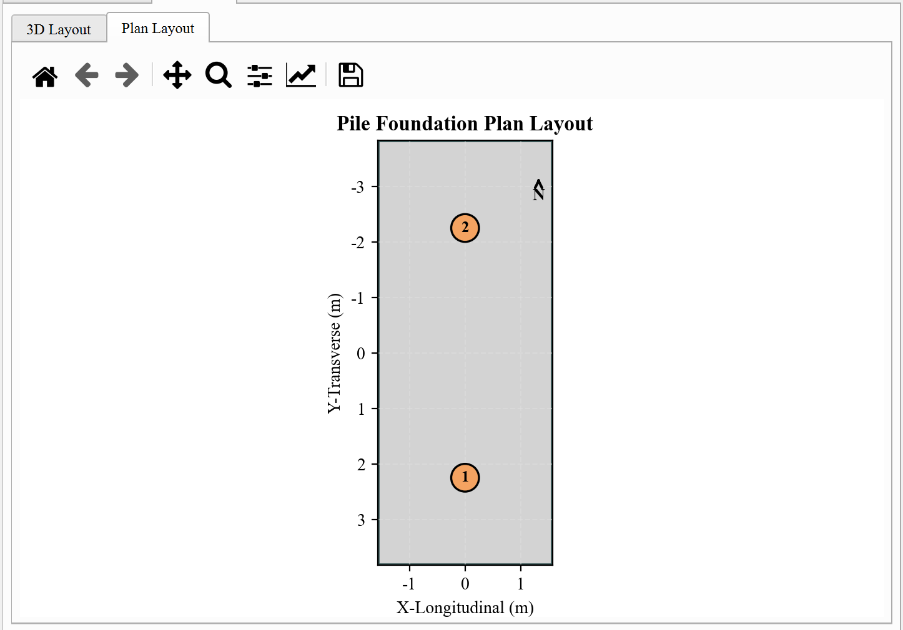

  <b>Fig. 7. Plan layout of the two-pile foundation.</b>

---

### 1.6 Result Interpretation

The main result of Mode 1 is the **Global Cap Stiffness Matrix**. This matrix represents the relationship between the generalized force components and generalized displacement components at the pile cap reference point.

The summary output reports the current analysis mode and displays the stiffness matrix result. For easier interpretation and subsequent use, the program provides both the original solver-coordinate matrix and the converted matrix using the Z-axis-upward convention.

  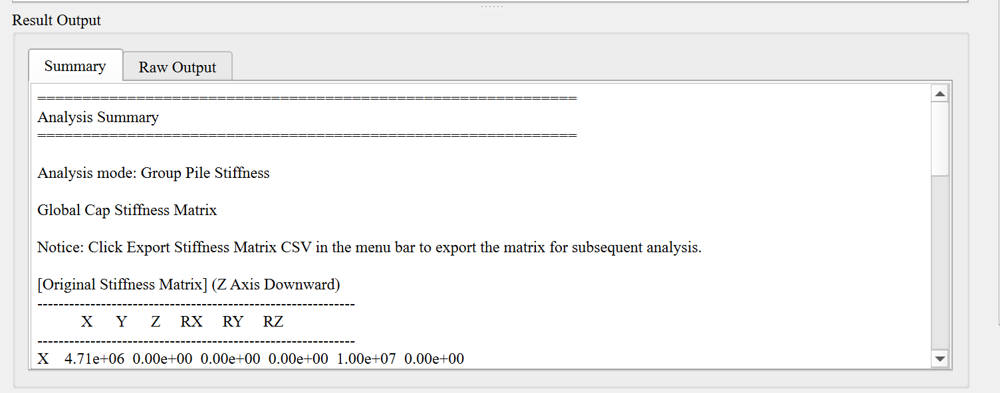

  <b>Fig. 8. Summary output of the group pile stiffness analysis.</b>

The stiffness matrix includes translational stiffness terms related to X, Y, and Z displacement, as well as rotational stiffness terms related to rotation about the X, Y, and Z axes. Coupling terms may also appear when the pile group layout or boundary conditions produce force-displacement coupling.

---

### 1.7 Stiffness Matrix Export

The global cap stiffness matrix can be exported as a CSV file for subsequent analysis. The exported file contains the case information, unit convention, converted stiffness matrix, and original stiffness matrix.

  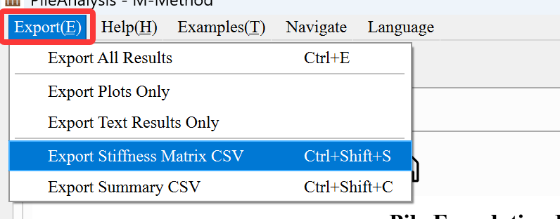

  <b>Fig. 9. Stiffness matrix export menu.</b>

The exported stiffness matrix can be opened in spreadsheet software or imported into external structural analysis programs. In this example, the exported matrix records that the model contains two piles and uses kN, m, and rad as the force, length, and rotation units.

  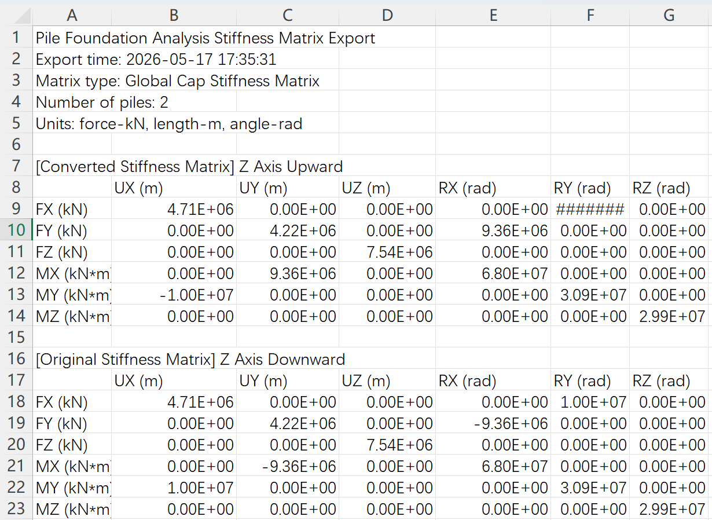

  <b>Fig. 10. Exported global cap stiffness matrix.</b>

---

### 1.8 Loading This Tutorial Example

The example shown in this tutorial is built into ***PileAnalysis***. Users can load it directly from the menu bar by selecting:

**Examples → Mode 1 Example: Group Pile Stiffness**

After the example is loaded, the program automatically fills in the pile definition, pile arrangement, and soil parameters. Users can then inspect the model, modify the parameters if needed, and run the analysis following the workflow described above.

## Tutorial 2: M-method Single Pile Stiffness Analysis

### 2.1 Example Description

This tutorial demonstrates **Mode 2: Single Pile Stiffness** in the m-method framework of ***PileAnalysis***.

The example scenario is the same as that used in Tutorial 1. The foundation consists of two vertical circular piles arranged symmetrically along the Y direction. Both piles use the same pile type and the same soil-layer parameters.

Different from Mode 1, which calculates the **global stiffness matrix of the whole pile group foundation**, Mode 2 focuses on the stiffness of a **specified single pile**. In this tutorial, **Pile No. 2** is selected as the target pile, and the program calculates the stiffness matrix corresponding to this selected pile.

  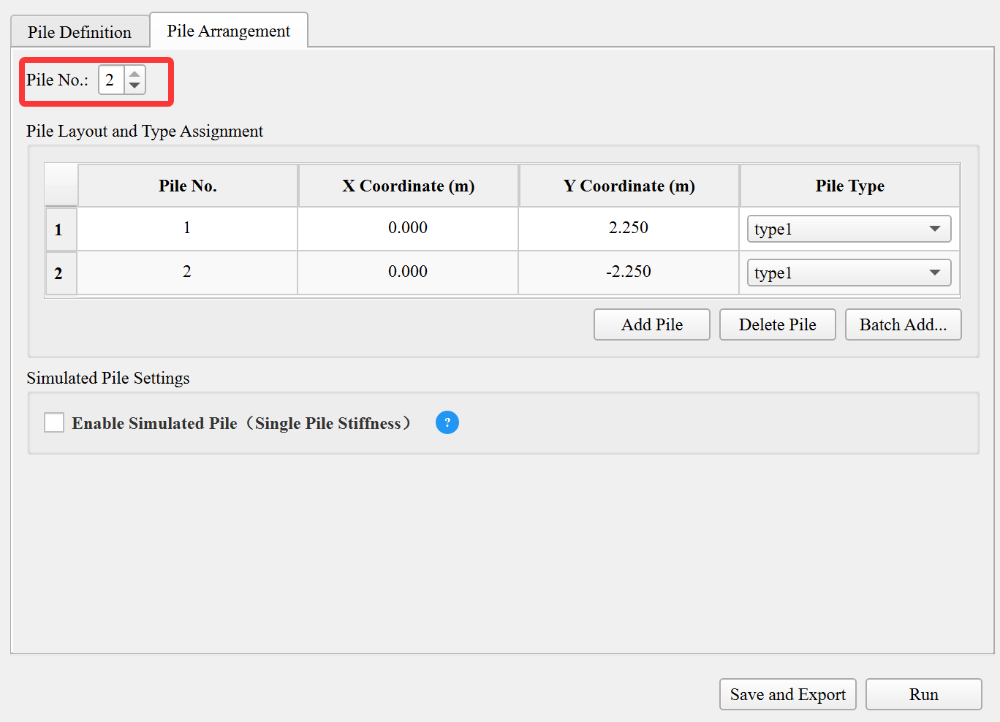

  <b>Fig. 1. Selecting Pile No. 2 for single pile stiffness analysis.</b>

---

### 2.2 Calculation Workflow

The overall calculation workflow of this tutorial is basically the same as Tutorial 1. Users still need to define the pile type, pile material parameters, embedded soil-layer parameters, pile-tip parameters, and pile coordinates.

The only additional step is to specify the target pile number in the pile arrangement interface. In this example, **Pile No. 2** is selected. After the target pile is selected, the analysis can be performed directly.

For Mode 2, no external load input is required. The purpose of this mode is to obtain the equivalent stiffness of the selected pile rather than to calculate the response under a specific load case.

---

### 2.3 Visualization and Result Export

The visualization process is the same as that in Tutorial 1. After the calculation is completed, users can view the 3D layout and plan layout to check the pile position and pile numbering.

The result output and export process are also similar to Tutorial 1. The difference is that the exported stiffness matrix corresponds to **Pile No. 2**, rather than the global cap stiffness matrix of the whole pile group.

Therefore, this tutorial is not repeated in detail. Users can follow the same visualization and export procedure introduced in Tutorial 1, while noting that the result in this case represents the **single pile stiffness matrix of Pile No. 2**.

This example is also built into ***PileAnalysis***. Users can load it directly from the menu bar by selecting **Examples → Mode 2 Example: Single Pile Stiffness**.

## Tutorial 3: M-method Back-Analysis

### 3.1 Example Description

This tutorial demonstrates **Mode 3: Back Analysis** in the m-method framework of ***PileAnalysis***. The example corresponds to **Example 1 in the PILE manual case series**, and is also used as a reference example in the related paper.

Different from Mode 1 and Mode 2, which focus on stiffness calculation, Mode 3 is used to calculate the pile foundation response under specified external loads. The program can output pile-head displacement, pile-head internal forces, and response distributions along each pile, including displacement, axial force, and bending moment.

In this example, the foundation consists of **12 piles** arranged in a rectangular pile group. Two load points are applied on the pile cap. Each load point contains horizontal forces, vertical force, and bending moments. The pile group response is calculated under the simultaneous action of the two load points.

  

  <b>Fig. 1. Schematic of the PILE manual Example 1 used in this tutorial.</b>

---

### 3.2 Load Input

For Mode 3, external loads must be defined before running the analysis. This example uses **multiple loads acting simultaneously**. Two load points are applied on the pile cap, located at `(-3.0, 0.0)` and `(3.0, 0.0)`.

For each load point, the applied load components are:

| Load Point | X (m) | Y (m) | Nx (kN) | Ny (kN) | Nz (kN) | Mx (kN·m) | My (kN·m) | Mz (kN·m) |
|---|---:|---:|---:|---:|---:|---:|---:|---:|
| Load 1 | -3.0 | 0.0 | 50.0 | 200.0 | 8000.0 | 2000.0 | 500.0 | 0.0 |
| Load 2 | 3.0 | 0.0 | 50.0 | 200.0 | 8000.0 | 2000.0 | 500.0 | 0.0 |

  

  <b>Fig. 2. Multiple load input for the back-analysis example.</b>

---

### 3.3 Pile Definition with Two-Section Geometry

After defining the load cases, the next step is to define the pile type and pile-soil parameters.

The main feature of this example is that each pile is defined with **two different pile diameters along the depth**. The upper section has a diameter of `1.5 m`, while the lower section has a diameter of `1.0 m`. This setting is used to model a stepped pile geometry, where the pile cross-section changes along the embedded depth.

In the pile definition interface, the above-ground segment is defined first. In this example, the free segment length is `2.0 m`, the diameter is `1.5 m`, and the subdivision count is `2`.

The embedded segment is then divided into two layers:

| Segment | Layer Thickness H (m) | Diameter D (m) | m Value (kN/m^4) | Internal Friction Angle φ | Subdivision Count N |
|---|---:|---:|---:|---:|---:|
| 1 | 10.0 | 1.5 | 1000.0 | 20.0 | 10 |
| 2 | 9.0 | 1.0 | 1000.0 | 20.0 | 9 |

The pile tip is modeled as a bored friction pile, and the pile-tip foundation coefficient is defined at the bottom of the input page.

  

  <b>Fig. 3. Pile definition with two-section pile geometry.</b>

Other pile material, soil parameter, and pile arrangement operations are similar to those introduced in Tutorial 1 and are not repeated here.

---

### 3.4 Visualization and Result Interpretation

After the load input, pile definition, and pile arrangement are completed, the analysis can be performed. The program provides 3D layout, plan layout, and pile response visualization.

The 3D view shows the overall pile group and cap geometry, while the plan view shows the pile numbering, pile locations, and the applied load points.

<table>
  <tr>
    <td align="center" width="50%">
      
       
      <b>Fig. 4. 3D layout of the 12-pile foundation.</b>
    </td>
    <td align="center" width="50%">
      
       
      <b>Fig. 5. Plan layout and load positions.</b>
    </td>
  </tr>
</table>

The **Pile Response** tab allows users to inspect the response of each pile. For each pile, ***PileAnalysis*** can display displacement, axial force, and bending moment distributions along the pile depth. The program can also automatically identify the **critical pile** for each response type, helping users quickly locate the most unfavorable pile response in the pile group.

<table>
  <tr>
    <td align="center" width="33%">
      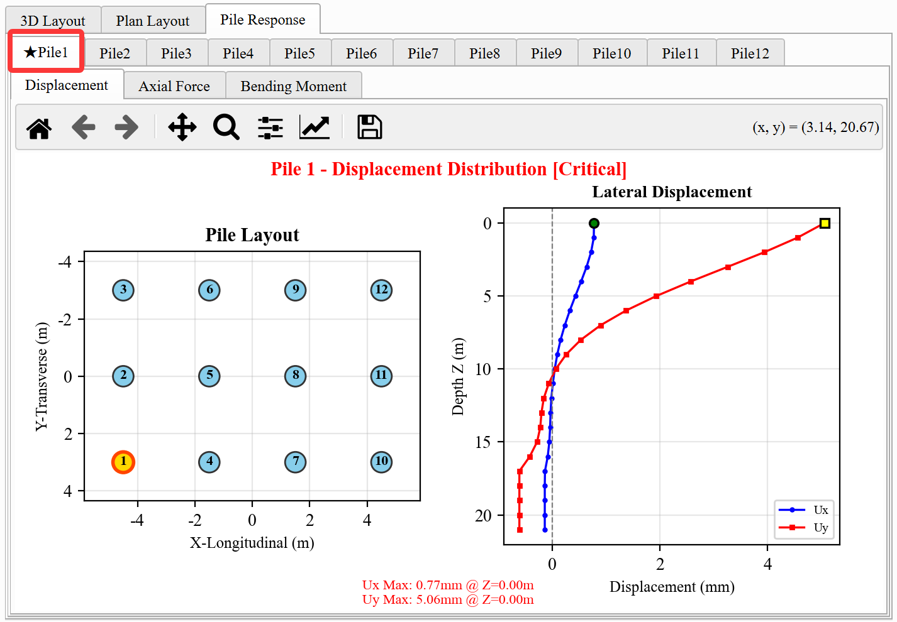
       
      <b>Fig. 6. Displacement distribution.</b>
    </td>
    <td align="center" width="33%">
      
       
      <b>Fig. 7. Axial force distribution.</b>
    </td>
    <td align="center" width="33%">
      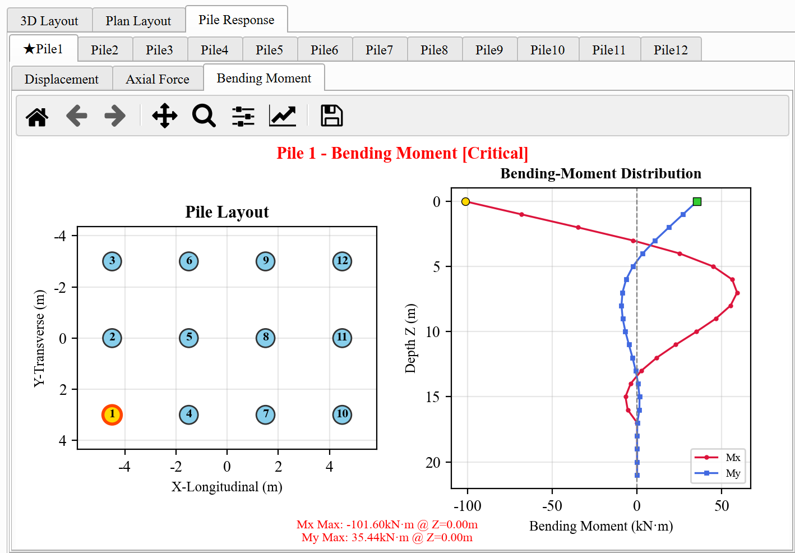
       
      <b>Fig. 8. Bending moment distribution.</b>
    </td>
  </tr>
</table>

The result summary lists the pile-head displacement and pile-head internal forces for each pile.

  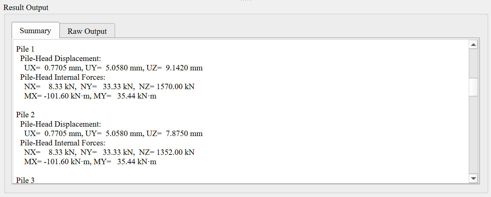

  <b>Fig. 9. Summary output of the back-analysis example.</b>

---

### 3.5 CSV Result Export

For Mode 3, the exported CSV results contain more response information than the stiffness modes. The main exported tables include:

- input load information;
- cap-center displacement;
- pile-head displacement summary;
- pile-head internal force summary;
- detailed pile-head response data.

The summary CSV records the load cases, cap-center displacement, and overall analysis information. The other exported tables provide pile-level response data for subsequent comparison, post-processing, or report preparation.

<table>
  <tr>
    <td align="center" width="50%">
      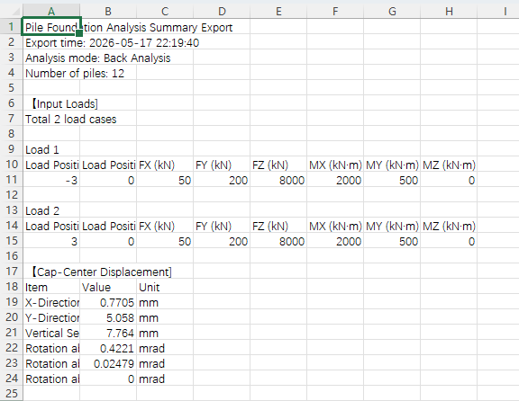
       
      <b>Fig. 10. Analysis summary and input load information.</b>
    </td>
    <td align="center" width="50%">
      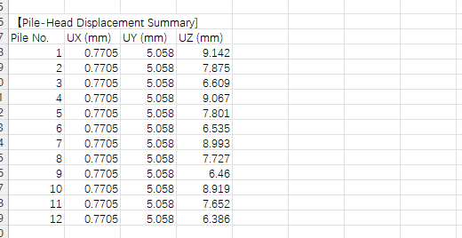
       
      <b>Fig. 11. Pile-head displacement summary.</b>
    </td>
  </tr>
  <tr>
    <td align="center" width="50%">
      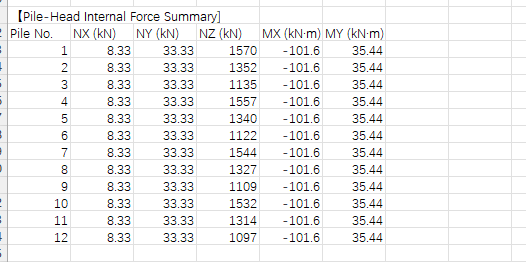
       
      <b>Fig. 12. Pile-head internal force summary.</b>
    </td>
    <td align="center" width="50%">
      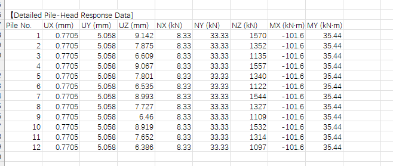
       
      <b>Fig. 13. Detailed pile-head response data.</b>
    </td>
  </tr>
</table>

Other visualization and export operations are similar to those described in Tutorial 1 and are not repeated here.

---

### 3.6 Loading This Tutorial Example

This example is built into ***PileAnalysis*** as the first PILE manual example. Users can load it directly from the menu bar by selecting:

**Examples → PILE Manual Examples → Example 1**

After the example is loaded, the program automatically fills in the load input, pile definition, pile arrangement, and soil parameters. Users can then run the analysis and inspect the results following the workflow described above.
## Tutorial 4: Nonlinear Axially Loaded Pile Analysis

### 4.1 Interface Overview

Tutorials 4-6 introduce the **single-pile loading analysis functions** in the nonlinear pile-soil interaction framework of ***PileAnalysis***. These three tutorials correspond to axial loading, lateral loading, and combined loading, respectively. This tutorial first uses the **axially loaded single pile** case to explain the basic interface and general modeling workflow.

As shown in Fig. 1, the nonlinear analysis interface consists of the **menu bar**, **analysis scope selection area**, **parameter input area**, **visualization area**, **result output area**, and **status bar**. The menu bar provides access to result export, help documentation, built-in examples, navigation, and language switching. The analysis scope selection area is used to choose between **Single Pile Analysis** and **Group Pile Analysis**. For single-pile analysis, users can further select **Axial Analysis**, **Lateral Analysis**, or **Combined Analysis**.

The parameter input area contains four main tabs: **Soil Material**, **Soil Layers**, **Pile Definition**, and **Load Input**. These tabs are shared by the single-pile loading cases in Tutorials 4-6, while the specific load components and response outputs change according to the selected analysis type. The visualization area displays the soil layer column, 3D pile-soil model, and response curves after calculation. The result output area provides both summary information and detailed data tables.

  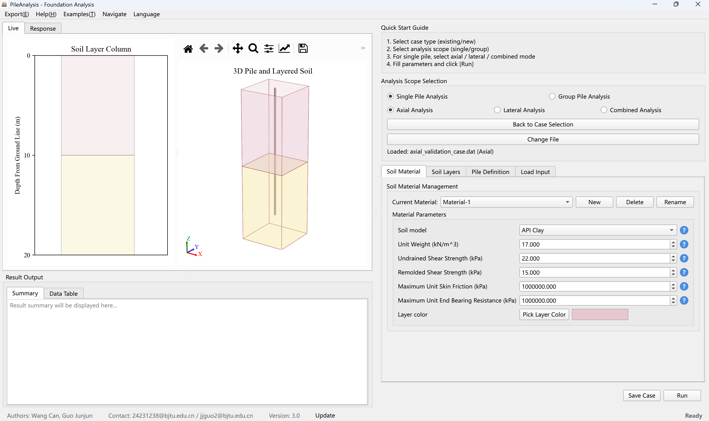

  <b>Fig. 1. Main interface for nonlinear single-pile loading analysis.</b>

---

### 4.2 Example Description

This example demonstrates the **axial loading case** of the nonlinear single-pile analysis module. The pile is embedded in a two-layer soil profile and subjected to an axial load at the pile head. The nonlinear axial pile-soil interaction is modeled through axial soil springs, including shaft resistance and end-bearing resistance.

The purpose of this example is to show the basic workflow for a single-pile loading analysis, including soil material definition, soil layer assignment, pile section definition, load input, mesh control, result visualization, and data export. The lateral and combined loading cases in Tutorials 5 and 6 follow the same general workflow, but use different load components and response outputs.

---

### 4.3 Soil Material Definition

The first step is to define the soil materials. In this example, two soil materials are used: one clay layer and one sand layer.

For the first material, the soil model is set to **API Clay**. The input parameters include unit weight, undrained shear strength, remolded shear strength, maximum unit skin friction, maximum unit end-bearing resistance, and layer color. Users can add or delete soil materials as needed and fill in the corresponding parameters according to the prompts provided in the interface.

  

  <b>Fig. 2. Soil material definition for API clay.</b>

The nonlinear framework also provides parameter help buttons beside the corresponding input fields. Users can quickly check the applicable model, parameter meaning, typical value range, and input guidance during modeling.

  

  <b>Fig. 3. Local parameter help for soil material input.</b>

In addition, a summarized soil material help window is provided. It collects the reference information for axial and lateral soil models, including API sand, API clay, drilled sand, drilled clay, and elastic models.

  

  <b>Fig. 4. Summary help window for soil material models.</b>

---

### 4.4 Soil Layer Definition

After defining the soil materials, the next step is to assign them to soil layers. Soil layer depths are referenced to the ground line, and negative values indicate downward depth.

In this example, the soil profile contains two layers:

| Layer | Top z (-m) | Bottom z (-m) | Soil Material |
|---|---:|---:|---|
| 1 | 0.0000 | -10.0000 | Material-1 |
| 2 | -10.0000 | -20.0000 | Material-2 |

  

  <b>Fig. 5. Soil layer definition for the axial loading example.</b>

The soil layer column and the 3D pile-soil view are updated according to the layer definition, helping users check whether the soil profile and pile position are reasonable.

---

### 4.5 Pile Definition

The **Pile Definition** tab is used to define the pile section and pile geometry. In this example, the pile is modeled with an elastic pipe section. The pile diameter is `0.5000 m`, the wall thickness is `0.0200 m`, and the elastic modulus is defined by the user. The pile extends from the ground surface to a depth of `17.0000 m`.

  

  <b>Fig. 6. Pile section and geometry definition.</b>

Besides elastic sections, ***PileAnalysis*** also supports nonlinear fiber-section input. Fiber-section modeling allows users to consider material nonlinearity of the pile section. This function is introduced in detail in **Tutorial 8: Nonlinear Fiber Section Import**, so it is not expanded here.

---

### 4.6 Load Input and Mesh Control

The **Load Input** tab defines the external axial load and the finite element mesh settings. In this example, an axial force of `-100 kN` is applied at the pile head. The sign convention follows the global Z axis: downward compression is negative, and upward tension is positive.

  

  <b>Fig. 7. Axial load input and mesh control.</b>

Users can also customize the finite element mesh. The program supports different mesh control methods, including **element number**, **element length**, and **user-defined mesh**. In this example, the advanced mesh setting is enabled, and the mesh is controlled by element number.

After the soil material, soil layers, pile definition, and axial load input are completed, the single-pile axial analysis can be performed.

---

### 4.7 Result Visualization

After the calculation is completed, the **Response** tab displays the nonlinear analysis results. For this axial loading example, the main response curves include vertical displacement and axial force along the pile depth.

<table>
  <tr>
    <td align="center" width="50%">
      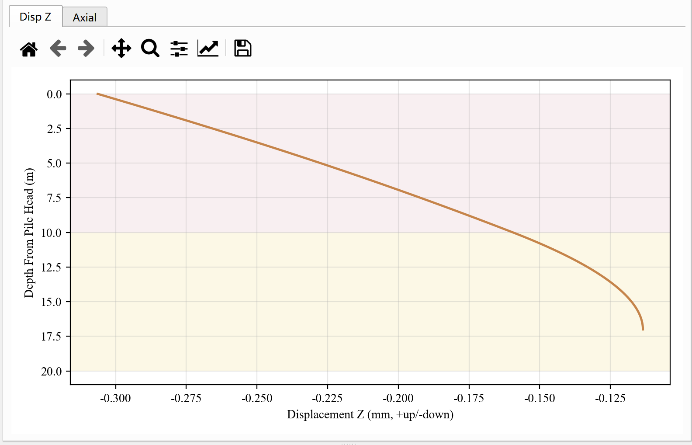
       
      <b>Fig. 8. Vertical displacement distribution.</b>
    </td>
    <td align="center" width="50%">
      
       
      <b>Fig. 9. Axial force distribution.</b>
    </td>
  </tr>
</table>

The detailed numerical results are also displayed in the **Data Table** tab. The table includes depth, vertical displacement, axial force, skin friction, ultimate skin resistance, and soil stiffness.

  

  <b>Fig. 10. Data table of axial pile response.</b>

---

### 4.8 Result Export

The nonlinear framework provides several export options, including result summary export, data table export, response chart export, and spring parameter export.

  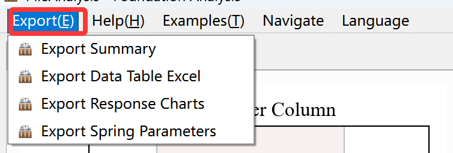

  <b>Fig. 11. Export options in the nonlinear framework.</b>

For this example, the response data table can be exported to Excel for further post-processing or report preparation.

  

  <b>Fig. 12. Exported response data table.</b>

The program can also export nonlinear spring parameters. This function is especially useful when users need to inspect or reuse generated *t-z*, *q-z*, or *p-y* spring data. The spring parameter export workflow is introduced in detail in **Tutorial 7: Nonlinear Pile Group Analysis**, so only the export entry is mentioned here.

---

### 4.9 Loading This Tutorial Example

This example is built into ***PileAnalysis*** as the axial nonlinear tutorial case. Users can load it directly from the menu bar by selecting:

**Examples → Axial Tutorial**

After the example is loaded, the program automatically fills in the soil materials, soil layers, pile definition, and axial load input. Users can then run the analysis and inspect the results following the workflow described above.
## Tutorial 5: Nonlinear Laterally Loaded Pile Analysis

## Tutorial 5: Nonlinear Laterally Loaded Pile Analysis

### 5.1 Example Description

This tutorial demonstrates the **lateral loading case** of the nonlinear single-pile analysis module. The overall modeling workflow is the same as Tutorial 4, including soil material definition, soil layer assignment, pile definition, load input, analysis, visualization, and result export.

The main difference is that this example focuses on the nonlinear lateral pile-soil interaction. The pile is subjected to a horizontal force and bending moment at the pile head, and the program calculates the lateral displacement, rotation, shear force, bending moment, soil reaction, and soil stiffness along the pile depth.

In this example, the soil profile contains two layers. The upper layer uses a soft clay model, and the lower layer uses a sand model. The pile is modeled as an elastic pipe section with a diameter of `0.5 m`, wall thickness of `0.02 m`, and total length of `19 m`.

The soil and pile input process is similar to Tutorial 4 and is not repeated here. The following sections mainly focus on the load input and lateral response visualization.

---

### 5.2 Load Input

For lateral analysis, the load input is different from the axial loading case. In this example, one lateral load case is applied at the pile head. The horizontal force is applied in the X direction, and a bending moment is applied about the Y axis.

The load components are:

| Load Case | Z (m) | Fx (kN) | Fy (kN) | Mx (kN·m) | My (kN·m) |
|---|---:|---:|---:|---:|---:|
| Case 1 | 0.000 | 50.000 | 0.000 | 0.000 | 100.000 |

  

  <b>Fig. 1. Load input for the nonlinear lateral loading example.</b>

---

### 5.3 Result Visualization

After the calculation is completed, the **Response** tab displays the lateral response results. Compared with the axial case in Tutorial 4, the lateral analysis provides more response components, including lateral displacement, rotation, shear force, bending moment, soil reaction, and soil stiffness.

  
  
  

  <b>Fig. 2. Lateral displacement X.</b>&nbsp;&nbsp;&nbsp;&nbsp;
  <b>Fig. 3. Rotation about Y.</b>&nbsp;&nbsp;&nbsp;&nbsp;
  <b>Fig. 4. Shear force X.</b>

  
  
  

  <b>Fig. 5. Bending moment X.</b>&nbsp;&nbsp;&nbsp;&nbsp;
  <b>Fig. 6. Soil reaction.</b>&nbsp;&nbsp;&nbsp;&nbsp;
  <b>Fig. 7. Soil stiffness.</b>

These plots allow users to inspect the lateral pile response along the depth and identify the critical deformation and internal-force regions. The soil reaction and soil stiffness curves are especially useful for checking the nonlinear *p-y* spring behavior generated by the program.

The result export workflow is the same as Tutorial 4. Users can export the result summary, data table, response charts, and spring parameters from the **Export** menu. The detailed spring parameter export workflow is introduced in Tutorial 7.

---

### 5.4 Loading This Tutorial Example

This example is built into ***PileAnalysis*** as the lateral nonlinear tutorial case. Users can load it directly from the menu bar by selecting:

**Examples → Lateral Tutorial**

After the example is loaded, the program automatically fills in the soil materials, soil layers, pile definition, and lateral load input. Users can then run the analysis and inspect the results following the workflow described above.
## Tutorial 6: Nonlinear Combined Loading Analysis

### 6.1 Example Description

This tutorial demonstrates the **combined loading case** of the nonlinear single-pile analysis module. The overall workflow is the same as Tutorials 4 and 5: users define the soil material, soil layer, pile section, load input, and then run the nonlinear analysis.

The difference is that the combined loading mode considers both **axial** and **lateral** pile-soil interaction in one model. In this example, the pile is subjected to a vertical axial force, a horizontal force, and a bending moment at the pile head. The program therefore calculates both axial response and lateral response of the pile.

This example contains one soil layer and one soil property. The pile is modeled as a circular elastic section with a diameter of `0.6 m`, a length of `15 m`, and an elastic modulus of `22000000 kPa`.

---

### 6.2 Soil Material Definition

For combined loading analysis, the soil material definition is slightly different from the pure axial and pure lateral examples. A single soil property can contain both an **Axial** model and a **Lateral** model.

In this example, only one soil property is used. The axial behavior is defined by the **API Sand** model, while the lateral behavior is defined by the **Soft Clay Soil** model. Users can switch between the **Axial** and **Lateral** tabs in the soil material interface and fill in the corresponding parameters for each direction.

  

  <b>Fig. 1. Soil material definition for combined axial-lateral analysis.</b>

The remaining soil layer and pile definition steps are the same as those introduced in Tutorial 4 and are not repeated here.

---

### 6.3 Load Input

The **Load Input** tab contains both axial and lateral load components. In this example, one load case is applied at the pile head. The vertical axial force is applied together with a horizontal force and a bending moment.

The load components are:

| Load Case | Z (m) | Fz (kN) | Fx (kN) | Fy (kN) | Mx (kN·m) | My (kN·m) |
|---|---:|---:|---:|---:|---:|---:|
| Case 1 | 0.000 | -100.000 | 50.000 | 0.000 | 0.000 | 100.000 |

  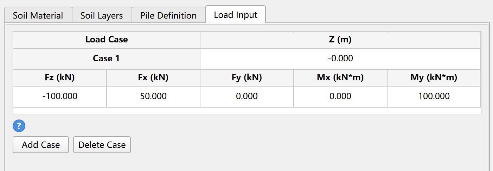

  <b>Fig. 2. Load input for the nonlinear combined loading example.</b>

The sign convention is the same as in Tutorial 4: downward compression is negative, and upward tension is positive. The lateral force and bending moment follow the global coordinate system shown in the interface.

---

### 6.4 Result Visualization

After the calculation is completed, the **Response** tab displays the combined response of the pile. Since this mode includes both axial and lateral effects, users can inspect axial force, vertical displacement, lateral displacement, rotation, shear force, bending moment, soil reaction, and soil stiffness depending on the selected response tab.

Only one representative result is shown here. Users can load and run the built-in example to inspect the full set of response plots.

  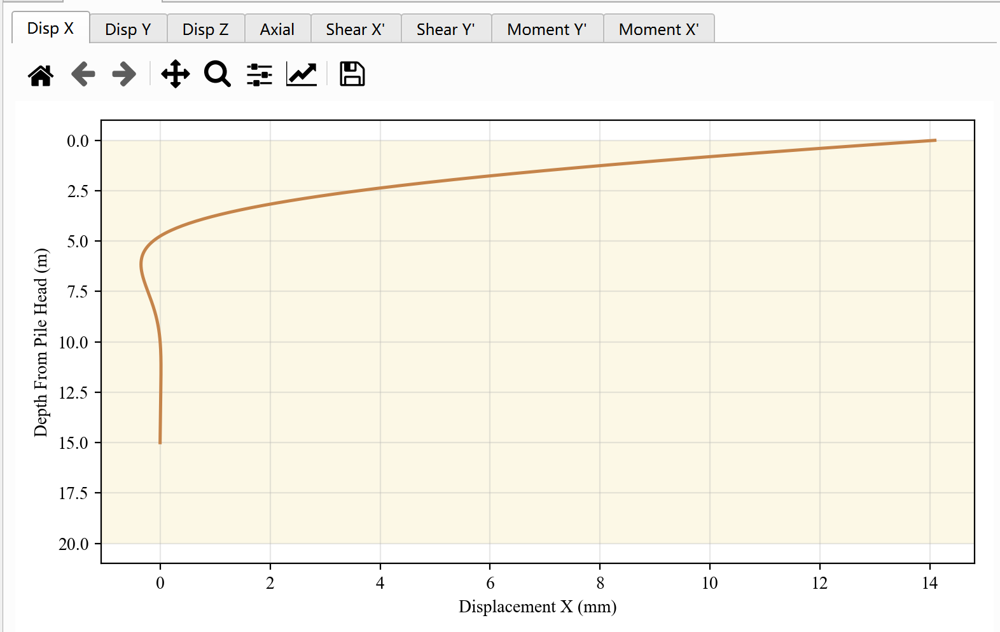

  <b>Fig. 3. Representative lateral displacement response under combined loading.</b>

The result export workflow is the same as Tutorial 4. Users can export the result summary, data table, response charts, and spring parameters from the **Export** menu.

---

### 6.5 Loading This Tutorial Example

This example is built into ***PileAnalysis*** as the combined nonlinear tutorial case. Users can load it directly from the menu bar by selecting:

**Examples → Combined Tutorial**

After the example is loaded, the program automatically fills in the soil material, soil layer, pile definition, and combined load input. Users can then run the analysis and inspect the full response results following the workflow described above.

## Tutorial 7: Nonlinear Pile Group Analysis

### 7.1 Example Description

This tutorial demonstrates the **nonlinear pile group analysis** function of ***PileAnalysis***. This example corresponds to the pile group case used in the ***PileAnalysis*** paper.

The foundation consists of a square pile cap and four pipe piles. The pile cap has a length of `6 m` in both the X and Y directions and a height of `1 m`. The four piles are arranged symmetrically under the cap, and the pile-cap connections are defined as fixed connections. The soil profile contains two layers. For each soil material, both axial and lateral soil-spring models are defined, so the program can generate *t-z*, *q-z*, and *p-y* springs for the pile group system.

The pile group is subjected to a horizontal load and a vertical load at the cap reference point. The analysis calculates the displacement and internal-force response of each pile, together with the nonlinear spring parameters used in the model.

  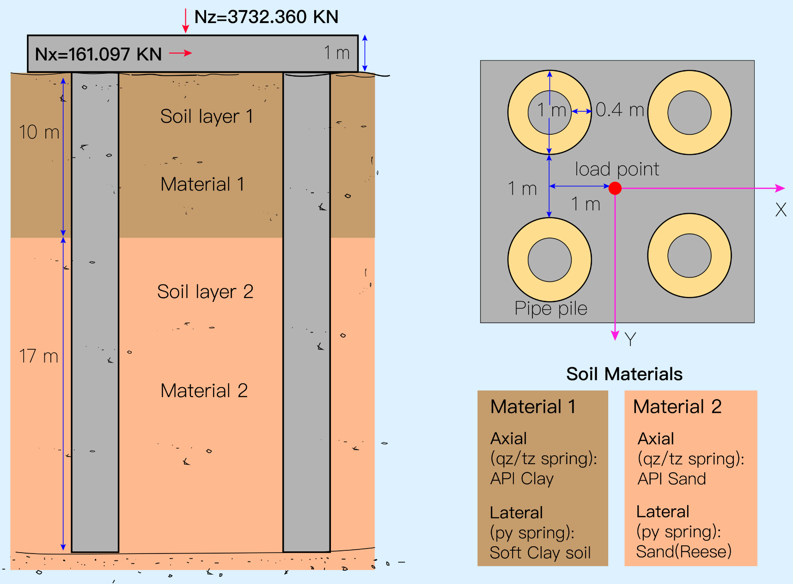

  <b>Fig. 1. Schematic of the nonlinear pile group example.</b>

---

### 7.2 Model Input

The soil material definition is similar to Tutorial 6. Each soil material includes both an **Axial** model and a **Lateral** model. In this example, Material 1 uses API Clay for axial springs and Soft Clay Soil for lateral springs, while Material 2 uses API Sand for axial springs and Sand for lateral springs.

Compared with the single-pile examples, the pile group module contains several additional input tabs, including **Cap Definition** and **Pile Layout**.

The **Cap Definition** tab is used to define the pile cap geometry. In this example, the cap length is `6 m` in the X direction, `6 m` in the Y direction, and the cap height is `1 m`.

  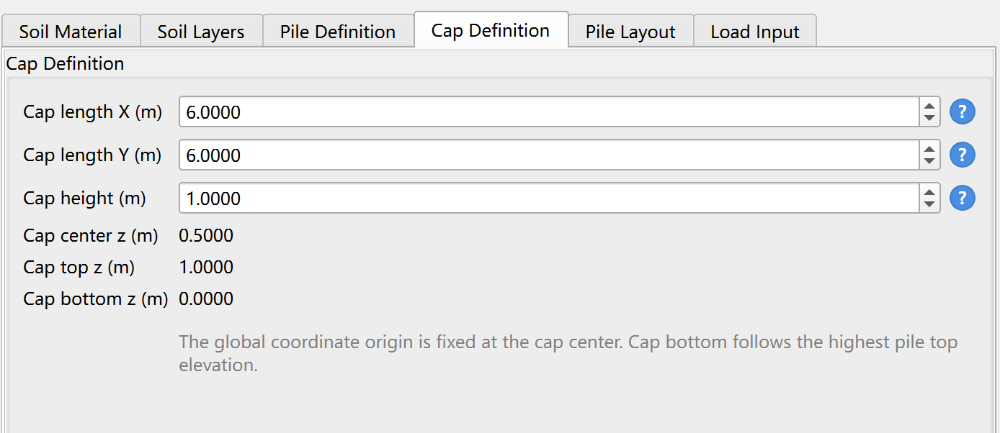

  <b>Fig. 2. Cap definition for the pile group model.</b>

The **Pile Layout** tab is used to define pile coordinates, pile top and bottom elevations, pile type, and pile-cap connectivity. In this example, four piles are located at `(-1, -1)`, `(1, -1)`, `(-1, 1)`, and `(1, 1)`. All piles use `PileType-1`, and the pile-cap connection is set to **Fixed**.

  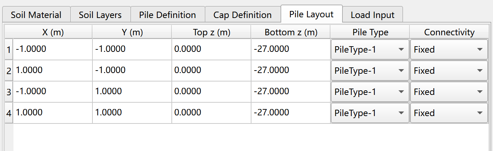

  <b>Fig. 3. Pile layout and pile-cap connectivity definition.</b>

The **Load Input** tab is used to define the external load applied to the cap. In this example, one load case is applied at the cap reference point, with a horizontal force and a vertical force.

| Load Case | X (m) | Y (m) | Nx (kN) | Ny (kN) | Nz (kN) | Mx (kN·m) | My (kN·m) | Mz (kN·m) |
|---|---:|---:|---:|---:|---:|---:|---:|---:|
| Load 1 | 0.000 | 0.000 | 161.907 | 0.000 | -3736.320 | 0.000 | 0.000 | 0.000 |

  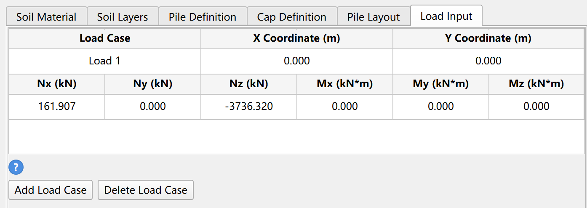

  <b>Fig. 4. Load input for the nonlinear pile group example.</b>

Other inputs, including soil layer definition, pile section definition, and mesh control, follow the same logic as the single-pile nonlinear examples and are not repeated here.

---

### 7.3 Result Visualization

After the analysis is completed, ***PileAnalysis*** provides response curves for each pile. Users can switch between different pile tabs and response components to inspect the calculated pile behavior.

The available response plots include X-direction displacement, Y-direction displacement, vertical displacement, axial force, shear force in two directions, and bending moment in two directions.

  
  

  <b>Fig. 5. X-direction displacement.</b>&nbsp;&nbsp;&nbsp;&nbsp;
  <b>Fig. 6. Y-direction displacement.</b>

  
  

  <b>Fig. 7. Vertical displacement.</b>&nbsp;&nbsp;&nbsp;&nbsp;
  <b>Fig. 8. Axial force.</b>

  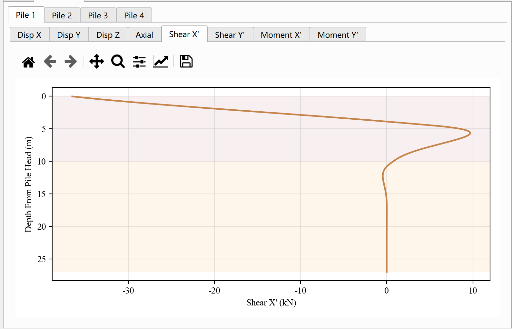
  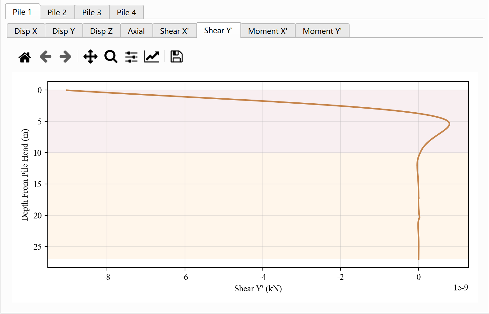

  <b>Fig. 9. Shear force X'.</b>&nbsp;&nbsp;&nbsp;&nbsp;
  <b>Fig. 10. Shear force Y'.</b>

  
  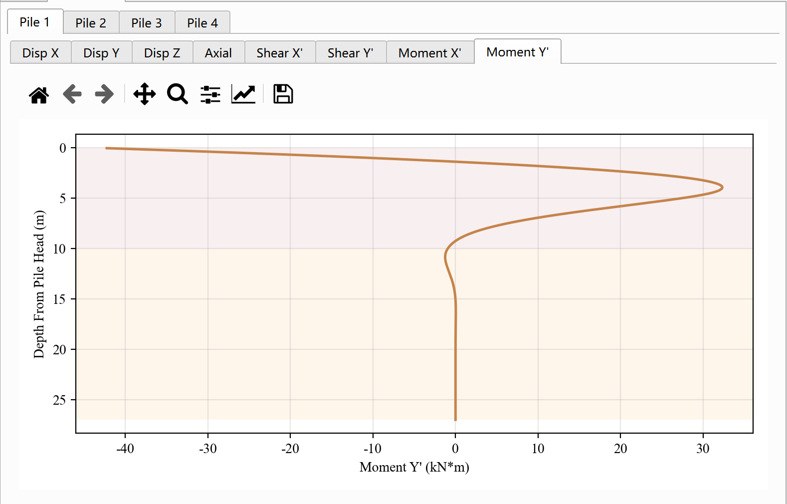

  <b>Fig. 11. Moment X'.</b>&nbsp;&nbsp;&nbsp;&nbsp;
  <b>Fig. 12. Moment Y'.</b>

The result output area also provides data tables. The **Overview** table summarizes pile-head displacement and maximum response values for all piles, while each pile tab provides detailed node-by-node response data.

  
  

  <b>Fig. 13. Overview data table.</b>&nbsp;&nbsp;&nbsp;&nbsp;
  <b>Fig. 14. Detailed pile response data table.</b>

---

### 7.4 Spring Parameter Export

A key function of the nonlinear pile group module is the export of generated soil spring parameters. These spring parameters can be used for checking the nonlinear soil model, post-processing, or building external finite element models.

Users can export the spring parameters from the menu bar by selecting **Export → Export Spring Parameters**.

  

  <b>Fig. 15. Exporting nonlinear spring parameters.</b>

The exported files include node coordinates and different types of soil spring data. The node file records the generated pile nodes and their coordinates.

  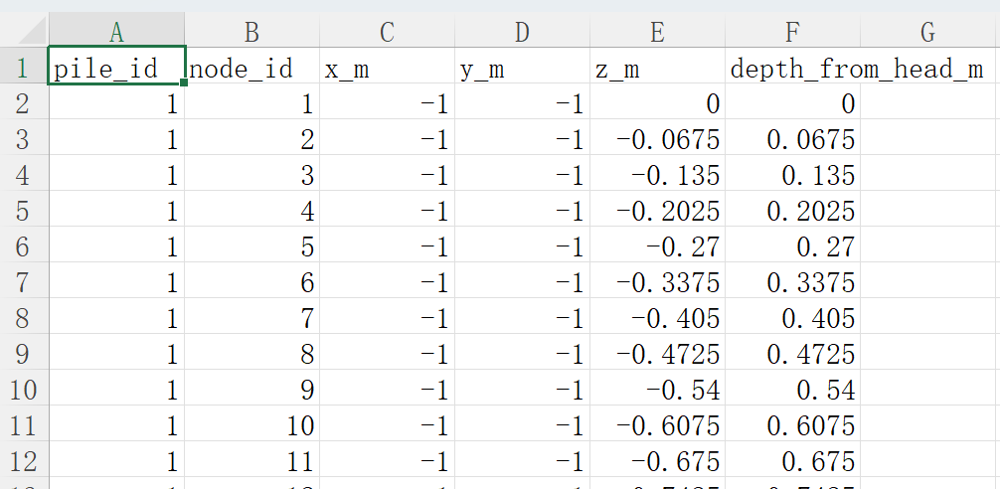

  <b>Fig. 16. Exported node coordinate table.</b>

The *p-y* spring file records the lateral soil spring parameters along the pile depth.

  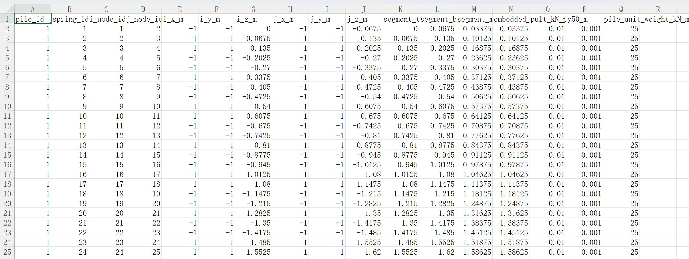

  <b>Fig. 17. Exported p-y spring parameters.</b>

The *t-z* spring file records the axial shaft resistance spring parameters.

  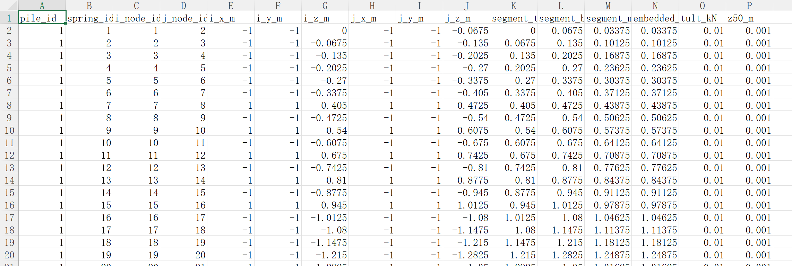

  <b>Fig. 18. Exported t-z spring parameters.</b>

The *q-z* spring file records the pile-tip resistance spring parameters.

  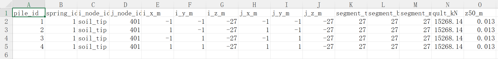

  <b>Fig. 19. Exported q-z spring parameters.</b>

These exported spring parameters provide a transparent record of the nonlinear pile-soil interaction model generated by ***PileAnalysis*** and can be reused in subsequent numerical modeling or verification work.

---

### 7.5 Loading This Tutorial Example

This example is built into ***PileAnalysis*** as the nonlinear pile group tutorial case. Users can load it directly from the menu bar by selecting:

**Examples → Group Tutorial**

After the example is loaded, the program automatically fills in the soil materials, soil layers, pile definition, cap definition, pile layout, and load input. Users can then run the analysis and inspect the results following the workflow described above.

## Tutorial 8: Nonlinear Fiber Section Import

<!-- 
This tutorial introduces how to import nonlinear fiber-section data from ***SectionMCPy***.

Suggested contents:
- Purpose of fiber-section import
- ***SectionMCPy*** data preparation
- HDF5 file import
- Fiber section visualization
- Connection with nonlinear pile analysis
- Example screenshots
-->

---

## Tutorial 9: Export Module and Special Functions

<!-- 
This tutorial introduces the export module and other special functions of ***PileAnalysis***.

Suggested contents:
- Result summary export
- Response curve export
- Stiffness matrix export
- Soil spring parameter export
- Node coordinate export
- Fiber-section data export
- Batch figure export
- External finite element software interaction
- Example screenshots
-->
